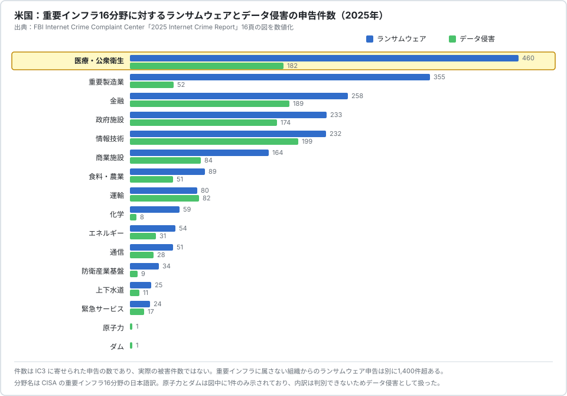

# 🌍 海外の統計

米国と EU の公的機関、および調査会社が公表する統計から、医療分野が国際的にどの位置にあるかを整理する。

> [!NOTE]
> **表記ルール**：本ページでは、**事実**（一次情報で確認できる内容。出典を併記する）、**報道ベース**（報道や第三者の集計のみで確認でき、当事者の公表資料では裏付けが取れていない内容）、**分析**（筆者の解釈）を書き分ける。
> 重要インフラの分野名は米国の区分名を指す。地の文で並列を書くときは読点を使うが、区分名としては原典の対応に合わせて「医療・公衆衛生」「食料・農業」と書く。

## 何を数えた統計なのか

海外の統計を日本の数字と並べるときは、報告制度の違いを先に見る。
米国には医療分野に固有の報告義務があり、それが統計の見え方を大きく変えている。

| 統計 | 公表元 | 母数になっているもの | 医療分野の扱い |
|---|---|---|---|
| [Internet Crime Report](https://www.ic3.gov/AnnualReport/Reports/) | FBI IC3 | IC3 に寄せられた申告（被害者の自発的な届出） | 重要インフラ 16 分野の一つとして集計 |
| [Breach Portal](https://ocrportal.hhs.gov/ocr/breach/breach_report.jsf) | 米国 HHS OCR | HIPAA に基づく報告義務（500 人以上に影響する侵害は 60 日以内） | 医療分野そのものが対象 |
| [Data Breach Investigations Report](https://www.verizon.com/business/resources/reports/dbir/) | Verizon | 協力機関から集めたインシデントデータ | 業種別に分析 |
| [Cost of a Data Breach Report](https://www.ibm.com/reports/data-breach) | IBM、Ponemon Institute | 侵害を経験した組織へのインタビュー（コスト算定） | 業種別に平均コストを算出 |
| [Threat Landscape](https://www.enisa.europa.eu/topics/cyber-threats/threats-and-trends) | ENISA（EU） | 公開報告されたインシデントの分析 | 分野別集計に health を含む |

**分析**：米国の HHS OCR ポータルは、医療分野だけを対象に、報告義務のもとで全件が公開される。
これに相当する仕組みは日本にも EU にもない。
したがって「米国の医療は被害が多い」という印象の一部は、可視性の高さによって作られている。

## 米国 FBI IC3「2025 Internet Crime Report」

**事実**：FBI の Internet Crime Complaint Center（IC3）は 2025 年に 100 万件を超える申告を受け、被害額は 209 億ドル（前年比 26% 増）だった。
ランサムウェアの申告は 3600 件超、報告された損失は 3200 万ドル超である。
新種のランサムウェアを 63 種確認しており、月平均 5.25 種にあたる（[2025 Internet Crime Report](https://www.ic3.gov/AnnualReport/Reports/2025_IC3Report.pdf)）。

### 重要インフラ 16 分野における位置

  

| 分野 | ランサムウェア | データ侵害 |
|---|---|---|
| 医療・公衆衛生 | 460 | 182 |
| 重要製造業 | 355 | 52 |
| 金融 | 258 | 189 |
| 政府施設 | 233 | 174 |
| 情報技術 | 232 | 199 |
| 商業施設 | 164 | 84 |
| 食料・農業 | 89 | 51 |
| 運輸 | 80 | 82 |

出典：2025 Internet Crime Report 16 頁の図を数値化

**事実**：医療・公衆衛生（Healthcare and Public Health）分野は、ランサムウェアの申告件数で 16 分野中の最多である。
2 位の重要製造業を 105 件上回る。
重要インフラに属さない組織からのランサムウェア申告は別に 1400 件超あり、その内訳は法務サービス 18%、建設請負 17%、エンジニアリングと建築 10% と続く。

**事実**：2025 年に IC3 へ多く報告されたランサムウェアの上位 10 種は、Akira、Qilin、INC./Lynx/Sinobi、BianLian、Play、RansomHub、LockBit、DragonForce、SAFEPAY、Medusa である。
これらで報告総数の 56.8% を占め、影響が大きかった分野として重要製造業、医療・公衆衛生、政府施設が挙げられている。

**分析**：上位の顔ぶれは日本の警察庁が集計した種別（Qilin、LockBit、Akira）とほぼ重なる。
RaaS は国を選ばずアフィリエイトに提供されるため、日本の医療機関と米国の病院は同じ手口の対象になる。
違うのは、被害が統計に現れる経路のほうである。

## 米国 HHS OCR ブリーチポータル

**事実**：HIPAA の Breach Notification Rule により、保護対象保健情報（PHI）の侵害が 500 人以上に影響する場合、対象事業者は 60 日以内に HHS の公民権局（OCR）へ報告する義務を負う。
報告された事案は [Breach Portal](https://ocrportal.hhs.gov/ocr/breach/breach_report.jsf) で公開される。

**報道ベース**：OCR ポータルを継続的に集計している HIPAA Journal の[統計ページ](https://www.hipaajournal.com/healthcare-data-breach-statistics/)によれば、年別の報告件数は次のとおりである。
同ページは 2026 年 8 月 4 日に更新され、同日に OCR から取得したデータ（対象期間は 2009 年 10 月 21 日から 2026 年 6 月 30 日）にもとづくと明記している。

| 年 | 500 人以上の侵害報告件数 |
|---|---|
| 2009 | 18 |
| 2015 | 270 |
| 2020 | 663 |
| 2021 | 715 |
| 2022 | 719 |
| 2023 | 746 |
| 2024 | 779 |
| 2025 | 789 |

**報道ベース**：2025 年に影響を受けた人数は約 1 億 3850 万人で、1 日あたり平均 37 万 9306 人にあたる。
2024 年は 1 日あたり平均 79 万 2226 人で、Change Healthcare の 1 件（1 億 9270 万人）が大部分を占める。
同ページは 2024 年の年間合計を数値で示しておらず、日平均から逆算した値を年間合計として引くわけにはいかない。
2009 年から 2025 年の累計では、10 億人分を超える PHI が影響を受けている。
原因別ではハッキングと IT インシデントが 8 割を超える。

> [!WARNING]
> OCR への報告は事後に追加されるため、同じ年の件数でも集計時点によって変動する。
> 数値を引用するときは、集計の基準日を併記する必要がある。

**事実**：本リポジトリが 2026 年 8 月 26 日に OCR ポータルから直接取得して集計した 2025 年の届出は 795 件、影響人数の合計は 1 億 4030 万 8908 人である。
上の HIPAA Journal の集計（789 件）と差があるのは、取得の時点が違うためである。
全件の分布と取得の手順は[2025 年 米国 HHS OCR 届出の全件集計](../incidents/global/2025-us-hhs.md)にまとめている。

**分析**：件数は 2020 年以降、660 件から 790 件の範囲で緩やかに増えている。
急増しているのは件数より影響人数で、これは医療データを預かる事業者（Business Associate）が侵害されたときに数千万人規模へ一気に広がる構造による。
日本で同じ構造を持つのは、地域医療連携基盤、レセプト関連事業者、検査受託事業者である。
[サプライチェーン](../../reference/pharma/supply-chain.md)と[クラウド事業者](../../technology/cloud/)の項で扱う。

## Verizon「Data Breach Investigations Report」

**報道ベース**：DBIR 2026 は全体で 3 万 1000 件超のインシデントと 2 万 2000 件超の侵害を分析している。
医療分野では 1492 件のインシデントと 1438 件の情報開示が確認された。
侵入経路は脆弱性の悪用 20%、フィッシング 14%、認証情報の窃取 11%、従業員のミス 11% である。
第三者が関与した侵害は 32% を占める。
全体ではランサムウェアが侵害の 48% に関与しており、前年の 44% から増えた（数値は [HIPAA Journal の記事](https://www.hipaajournal.com/verizon-dbir-2026-healthcare/)による。原資料は [Verizon DBIR](https://www.verizon.com/business/resources/reports/dbir/)）。

**分析**：医療分野は歴史的に「内部要因とミスの比率が高い業種」として扱われてきたが、DBIR の直近版では脆弱性の悪用が首位に立っている。
これは警察庁の統計が示す侵入経路の傾向と同じ方向である。

## IBM「Cost of a Data Breach Report」

**報道ベース**：2026 年 7 月 29 日公表の 2026 年版では、全業種の平均侵害コストは 499 万ドル（前年比 12% 増）で、調査開始から最高だった。
業種別では医療が 664 万ドルで最も高く、金融の 629 万ドルが続く。
医療が業種別で最高となるのは 13 年連続である。
調査は Ponemon Institute が 2025 年 3 月から 2026 年 2 月にかけて 602 組織を対象に実施した（[IBM](https://www.ibm.com/reports/data-breach)。数値は公表報道による）。

**分析**：医療のコストが高い理由として、規制対応（HIPAA の制裁金と訴訟）、患者への通知、診療停止による逸失収益が挙げられる。
日本の医療機関には HIPAA に相当する制裁金の制度がないため、この金額をそのまま国内に当てはめることはできない。
一方で、警察庁の統計が示す「調査費用 1000 万円以上が半数超」という水準は、日本の医療機関にとっても現実的な桁である。

## EU ENISA

### ENISA Threat Landscape 2025

**事実**：ENISA は 2024 年 7 月から 2025 年 6 月までの 4875 件のインシデントを分析した。
分野別では公共行政が 38.2% で最多、運輸 7.5%、デジタルインフラとサービス 4.8%、金融 4.5% と続く。
医療分野に影響したインシデントは、確認されたサイバー犯罪インシデント全体の 4.2% だった（[ENISA Threat Landscape 2025](https://www.enisa.europa.eu/sites/default/files/2026-01/ENISA%20Threat%20Landscape%202025_v1.2.pdf)）。

### ENISA Health Threat Landscape

**事実**：ENISA が 2023 年 7 月 5 日に公表した医療分野に特化した初のレポートは、2 年余りの期間に EU と近隣国で公開報告された 215 件のインシデントを分析している（[ENISA](https://www.enisa.europa.eu/news/checking-up-on-health-ransomware-accounts-for-54-of-cybersecurity-threats)）。

| 項目 | 割合 |
|---|---|
| ランサムウェアが占める割合 | 54%（116 件） |
| 被害を受けた組織のうち医療提供者 | 53%（うち病院 42%） |
| 狙われた資産のうち患者データ | 30% |
| 影響：データの侵害または窃取 | 43% |
| 影響：医療サービスの停止 | 22% |
| ランサムウェア専門の防御プログラムを持つ組織 | 27% |

重大インシデントのコストの中央値は 30 万ユーロだった。

**分析**：EU の集計で医療の比率が米国より低いのは、母数の作り方が違うためである。
ENISA は公開報告されたインシデントを数えており、報告義務に基づく全件把握ではない。
NIS2 指令の施行によって報告の網が広がれば、この比率は変わる可能性がある。

## 民間調査：Sophos「The State of Ransomware in Healthcare 2025」

**事実**：Sophos は 17 か国の 3400 組織を対象とした調査のうち、医療提供者 292 組織の回答を分析した。
調査は 2025 年 1 月から 3 月に実施された（[Sophos](https://www.sophos.com/en-us/blog/the-state-of-ransomware-in-healthcare-2025)）。

| 項目 | 2025 年 | 比較 |
|---|---|---|
| データを暗号化された割合 | 34% | 2024 年は 74% |
| 暗号化を伴わない恐喝のみ | 12% | 2022 年から 2023 年は 4% |
| 身代金を支払った割合 | 36% | 2022 年は 61% |
| バックアップから復旧した割合 | 51% | 前年は 72% |
| 身代金の要求額（中央値） | 34 万 3,000 ドル | 2024 年は 400 万ドル |
| 支払額（中央値） | 15 万ドル | 2024 年は 147 万ドル |
| 復旧コストの平均（身代金を除く） | 102 万ドル | 2024 年は 257 万ドル |

**事実**：攻撃の技術的な根本原因では、悪用された脆弱性が 33% で最多だった。
組織的な要因では、人員や対応能力の不足が 42%、既知のセキュリティギャップの放置が 41% を占めた。

**分析**：暗号化まで到達された割合が 74% から 34% へ下がった一方、恐喝のみの攻撃が増えている。
バックアップ対策が効いてくると、攻撃者は暗号化をやめてデータの公開圧力に切り替える。
日本のノーウェアランサムの集計（2023 年 30 件、2025 年 17 件）とは方向が逆に見えるが、日本の集計は届出ベースで母数が小さく、直接の比較はできない。
医療機関にとっては、暗号化を防いでも患者データの公開という圧力が残ることを意味する。

## 海外統計から医療分野について言えること

**事実**：米国 IC3 の集計では、医療・公衆衛生は重要インフラ 16 分野でランサムウェア申告件数が最多である。
EU ENISA の集計では、医療は全インシデントの 4.2% である。
IBM の集計では、医療は 13 年連続で業種別のコストが最高である。

**分析**：三つの統計は矛盾していない。
それぞれ違うものを測っている。

| 統計 | 測っているもの | 医療が上位に来る理由 |
|---|---|---|
| IC3 | 米国内の申告件数 | HPH セクターが政策上明確に定義され、報告と情報共有の枠組み（HHS、CISA）が整っている |
| ENISA | EU の公開報告インシデント | 公共行政へのハクティビズムが多数を占めるため、相対的に医療の比率が下がる |
| IBM | 1 件あたりのコスト | 規制対応と通知の費用、診療停止の逸失が積み上がる |

共通して言えるのは、**医療分野は件数の順位が国によって変わるが、1 件あたりの影響とコストは一貫して重い**ということである。
順位の議論より、自組織で 1 件起きたときの停止時間と費用を見積もるほうが、対策の優先順位づけに直結する。

---

日本の統計は[日本の統計](japan.md)にまとめている。
両者の比較と、統計を読むときの注意は[統計から読む脅威](README.md)にある。

---

[統計から読む脅威](README.md) | [脅威](../README.md) | [トップへ](../../../README.md)
