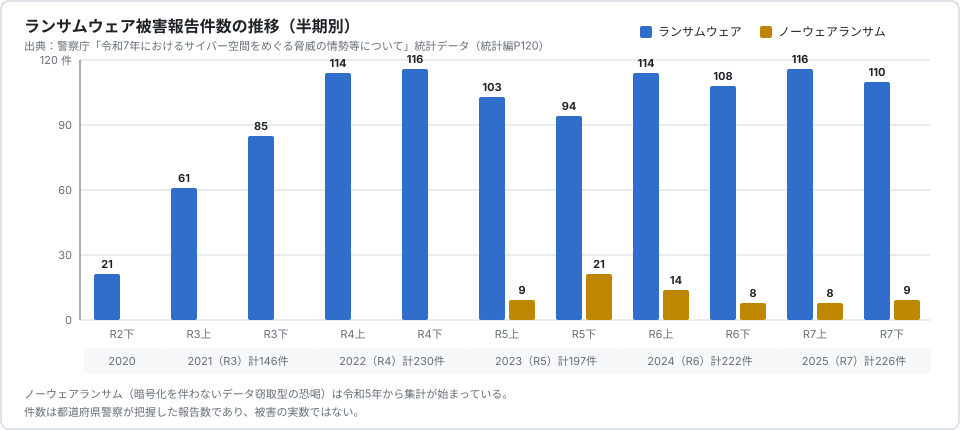
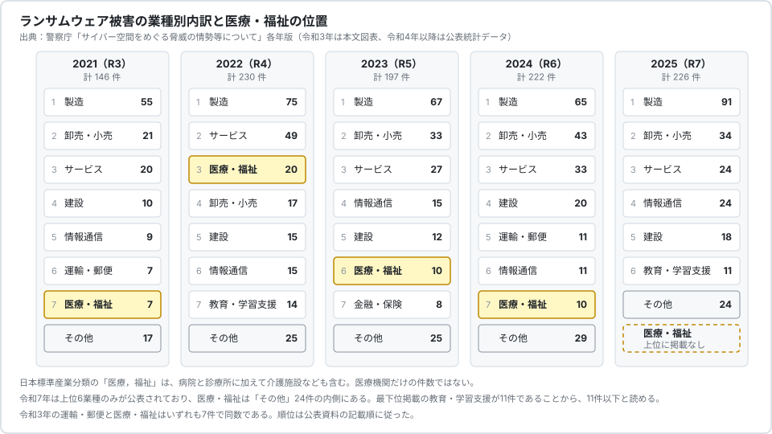

# 🇯🇵 日本の統計

警察庁、IPA、個人情報保護委員会、厚生労働省が公表する統計から、日本のサイバー攻撃の情勢と、そこに医療分野がどう現れるかを整理する。

> [!NOTE]
> **表記ルール**：本ページでは、**事実**（一次情報で確認できる内容。出典を併記する）、**報道ベース**（報道や第三者の集計のみで確認でき、当事者の公表資料では裏付けが取れていない内容）、**分析**（筆者の解釈）を書き分ける。
> 本ページの数値は、特記しない限り各機関の公表資料または公表統計データ（Excel）から直接引いた**事実**である。
> 業種名は日本標準産業分類の区分名を指す。分類の正式表記は「医療，福祉」だが、警察庁の資料の表記に合わせて「医療・福祉」と書く。

## 何を数えた統計なのか

同じ「サイバー攻撃の件数」でも、数え方は機関ごとに違う。
先にこれを押さえないと、数字の大小を誤って比較する。

| 統計 | 公表元 | 母数になっているもの | 更新 |
|---|---|---|---|
| [サイバー空間をめぐる脅威の情勢等について](https://www.npa.go.jp/publications/statistics/cybersecurity/index.html) | 警察庁 | 都道府県警察が把握したランサムウェア被害の報告、検挙件数、相談件数 | 年 2 回（年間、上半期） |
| [情報セキュリティ10大脅威](https://www.ipa.go.jp/security/10threats/index.html) | IPA | 前年の事案から選出した脅威候補への投票結果（件数統計ではない） | 年 1 回 |
| [年次報告](https://www.ppc.go.jp/aboutus/report/) | 個人情報保護委員会 | 個人情報保護法第 26 条に基づく漏えい等報告の処理件数 | 年 1 回 |
| [病院における医療情報システムのサイバーセキュリティ対策に係る調査](https://www.mhlw.go.jp/stf/shingi/other-isei_210261.html) | 厚生労働省 | 全国の病院へのアンケート（対策の実施状況。被害件数ではない） | 年 1 回 |

警察庁の統計は被害の実数ではなく、警察が把握できた範囲の数である。
個人情報保護委員会の統計は個人データの漏えいを対象とするため、暗号化だけで漏えいのない被害は入らない。
厚生労働省の調査は対策の実施率を測るもので、被害件数を数えていない。

**分析**：この三つを足しても「日本の医療機関が年に何件のサイバー攻撃を受けたか」は出ない。
医療機関の被害件数を継続的に集計した公的統計は、本ページの調査時点では見つけられなかった。

## 警察庁「サイバー空間をめぐる脅威の情勢等について」

サイバー攻撃の全体像を数字で追える国内の一次資料としては、これがもっとも情報量が多い。
[令和 7 年版](https://www.npa.go.jp/publications/statistics/cybersecurity/data/R7/R07_cyber_jousei.pdf)（2026 年 3 月公表）に加えて、各年の[統計データ（Excel）](https://www.npa.go.jp/publications/statistics/cybersecurity/index.html)が公開されており、図表の元数値をそのまま引ける。

### ランサムウェア被害報告件数の推移

  

| 年 | ランサムウェア | ノーウェアランサム |
|---|---|---|
| 2021（R3） | 146 | 集計なし |
| 2022（R4） | 230 | 集計なし |
| 2023（R5） | 197 | 30 |
| 2024（R6） | 222 | 22 |
| 2025（R7） | 226 | 17 |

出典：[令和 7 年 統計データ](https://www.npa.go.jp/publications/statistics/cybersecurity/data/R7/R07_jousei_data.xlsx)（統計編 P120）

**事実**：2022 年に 230 件へ跳ね上がったあと、年間 200 件前後で推移している。
半期別に見ると 2022 年上半期の 114 件以降、94 件から 116 件の幅を出ていない。
**ノーウェアランサム**（暗号化せず、窃取したデータの公開を予告して金銭を要求する手口）は 2023 年の 30 件から 2025 年の 17 件へ減っている。

**分析**：この統計で「増えている」と言えるのは 2021 年から 2022 年にかけての立ち上がりまでで、直近 4 年は高止まりである。
増減の解釈には注意がいる。
報告件数は、攻撃の発生数だけでなく、被害組織が警察に届け出る割合にも左右される。

### 業種別内訳における医療・福祉

  

| 年 | 医療・福祉の件数 | 全体に占める割合 | 順位 | 首位（製造業） |
|---|---|---|---|---|
| 2021（R3） | 7 | 4.8% | 7 位 | 55 |
| 2022（R4） | 20 | 8.7% | 3 位 | 75 |
| 2023（R5） | 10 | 5.1% | 6 位 | 67 |
| 2024（R6） | 10 | 4.5% | 7 位 | 65 |
| 2025（R7） | 上位に掲載なし | ー | ー | 91 |

出典：[令和 3 年版](https://www.npa.go.jp/publications/statistics/cybersecurity/data/R03_cyber_jousei.pdf)（26 頁の図）、[令和 4 年](https://www.npa.go.jp/publications/statistics/cybersecurity/data/R04_jousei_data.xlsx)、[令和 5 年](https://www.npa.go.jp/publications/statistics/cybersecurity/data/R5/R05_jousei_data.xlsx)、[令和 6 年](https://www.npa.go.jp/publications/statistics/cybersecurity/data/R6/R06_jousei_data.xlsx)、[令和 7 年](https://www.npa.go.jp/publications/statistics/cybersecurity/data/R7/R07_jousei_data.xlsx)の各統計データ

**事実**：2025 年の業種別内訳は上位 6 業種のみが公表されており、医療・福祉は含まれていない。
最下位に掲載された教育、学習支援業が 11 件であることから、医療・福祉は 11 件以下と読める。
2025 年上半期の内訳でも、最下位掲載は運輸業、郵便業の 7 件で、医療・福祉は掲載されていない。

**事実**：日本標準産業分類の「医療，福祉」は、病院と診療所のほかに介護施設、社会福祉事業も含む区分である。
したがってこの数字は医療機関だけの件数ではない。

**分析**：2022 年の 20 件は突出している。
同年には[つるぎ町立半田病院](../incidents/japan/2021-timeline.md#JP-2021-01)（2021 年 10 月）に続いて[大阪急性期・総合医療センター](../incidents/japan/2022-timeline.md#JP-2022-01)（2022 年 10 月）の被害が起き、医療機関の被害が注目された時期にあたる。
報告件数の増加が、実際の被害増と届出率の上昇のどちらをどれだけ反映しているかは、この統計だけでは切り分けられない。

### 被害組織の規模

| 区分 | 2025 年の件数 |
|---|---|
| 大企業 | 64 |
| 中小企業 | 143 |
| 団体等 | 19 |
| 合計 | 226 |

出典：令和 7 年 統計データ（統計編 P122）

**事実**：中小企業が 143 件で全体の 63.3% を占める。
公立病院や医療法人は「団体等」または「中小企業」に分類されうるが、公表資料では業種と規模のクロス集計は示されていない。

### 侵入経路

| 経路 | 2022（R4） | 2023（R5） | 2024（R6） | 2025（R7） |
|---|---|---|---|---|
| VPN 機器 | 63（62%） | 73（63%） | 55（55%） | 61（66%） |
| リモートデスクトップ | 19（19%） | 21（18%） | 31（31%） | 19（21%） |
| 不審メール、添付ファイル | 9（9%） | 6（5%） | 2（2%） | 2（2%） |
| その他 | 11 | 15 | 12 | 10 |
| 有効回答 | 102 | 115 | 100 | 92 |

出典：各年の統計データ（令和 7 年は統計編 P124）

**事実**：4 年連続で、インターネットに露出した VPN 機器とリモートデスクトップの合計が有効回答の 8 割前後を占める。
メールを起点とする感染は 2025 年で 2 件にとどまる。

**事実**：侵入経路とされた機器のセキュリティパッチ適用状況では、未適用のパッチがあった組織が 40 件、最新のパッチを適用済みだった組織が 31 件だった（有効回答 71 件、統計編 P134）。

**分析**：医療機関のリモート保守は、装置ベンダごとに VPN 装置や保守回線が持ち込まれ、契約上の責任分界が装置単位で切れていることが多い。
この構造では、装置の数だけインターネットに面した入口が増える。
機器の棚卸しについては[組織の脆弱性の分類](../actors/organizational-vulnerabilities.md)、対策の順序については[防御プレイブック](../actors/defense-playbook.md)を参照してほしい。

### 復旧に要した期間と費用

| 復旧期間 | 件数 |
|---|---|
| 即時から 1 週間未満 | 29 |
| 1 週間から 1 か月未満 | 31 |
| 1 か月から 2 か月未満 | 15 |
| 2 か月以上 | 7 |
| 復旧中 | 25 |
| 合計 | 107 |

| 調査費用の総額 | 件数 |
|---|---|
| 100 万円未満 | 16 |
| 100 万円以上 500 万円未満 | 18 |
| 500 万円以上 1,000 万円未満 | 9 |
| 1,000 万円以上 5,000 万円未満 | 32 |
| 5,000 万円以上 1 億円未満 | 9 |
| 1 億円以上 | 5 |
| 合計 | 89 |

出典：令和 7 年 統計データ（統計編 P125、P126）

**事実**：1000 万円以上を要した組織は 46 件で、有効回答の 51.7% にあたる。
回答時点で復旧中の組織が 25 件ある。

**事実**：業務への影響は、全業務停止が 9 件、一部の業務に影響ありが 97 件、影響なしが 11 件だった（有効回答 117 件、統計編 P131）。

### バックアップは機能したか

| 項目 | 件数 |
|---|---|
| バックアップを取得していた | 105 / 116 |
| バックアップから復元できた | 20 / 99 |
| 復元できなかった理由：バックアップも暗号化 | 48 / 72 |
| 復元できなかった理由：運用不備 | 19 / 72 |

出典：令和 7 年 統計データ（統計編 P128、P129、P130）

**事実**：バックアップを取得していた組織は 9 割に達するが、そこから復元できたのは有効回答 99 件のうち 20 件である。
復元できなかった理由の最多は、バックアップ自体が暗号化されていたことだった。

**分析**：「バックアップの有無」ではなく「攻撃者から隔離されているか」が分岐点になっている。
オフラインバックアップの確保は、令和 6 年度の診療報酬改定で診療録管理体制加算の要件に取り込まれている（[厚生労働省 第 32 回医療等情報利活用ワーキンググループ 資料 7](https://www.mhlw.go.jp/content/10808000/001705951.pdf)）。

### 備えの状況

| 項目 | 件数 |
|---|---|
| サイバー攻撃を想定に含む BCP を策定済 | 20 / 111（18.0%） |
| サイバー攻撃を想定に含まない BCP を策定済 | 44 / 111 |
| BCP を策定していない | 47 / 111 |
| セキュリティ監査を実施していない | 63 / 111 |
| ログを全て保全できた | 25 / 102 |

出典：令和 7 年 統計データ（統計編 P132、P133、P137）

**事実**：被害組織のうち、サイバー攻撃を想定した BCP を持っていたのは約 18% である。
ログを全て保全できた組織は 4 分の 1 にとどまり、使用できなくなった原因は犯人による削除 20 件、暗号化 20 件、保存期間の経過 18 件だった（統計編 P138）。

### 攻撃に使われたランサムウェア

| 2024（R6） | 件数 | 2025（R7） | 件数 |
|---|---|---|---|
| LockBit | 31 | Qilin | 32 |
| 8base | 17 | LockBit | 19 |
| RansomHub | 12 | Akira | 17 |
| Akira | 9 | Lynx | 8 |
| Makop | 8 | RansomHub | 8 |
| Phobos | 6 | ー | ー |
| その他 | 50 | その他 | 65 |

出典：令和 7 年 統計データ（図表 12、図表 12⑵）

**事実**：2024 年に最多だった LockBit は 2025 年に 19 件へ減り、代わって Qilin が 32 件で最多となった。
グループごとの手口は[ランサムウェアグループの TTPs](../actors/ransomware-groups.md) にまとめている。

### サイバー空間全体の指標

| 指標 | 2019（R1） | 2023（R5） | 2024（R6） | 2025（R7） |
|---|---|---|---|---|
| サイバー犯罪の検挙件数 | 9,519 | 12,479 | 13,164 | 15,108 |
| フィッシング報告件数 | 55,787 | 1,196,390 | 1,718,036 | 2,454,297 |
| ネットバンキング不正送金の発生件数 | ー | 5,578 | 4,369 | 4,747 |
| 同 被害額 | 約 25.2 億円 | 約 87.3 億円 | 約 86.9 億円 | 約 104.0 億円 |
| 警察庁のセンサーが検知した不審なアクセス（1 日 1 IP アドレスあたり） | 4,192 | 9,145 | 9,520 | 9,606 |

出典：令和 7 年 統計データ（統計編 P139 から P145、図表 13、図表 21）

**事実**：フィッシングの報告件数は 2019 年から 2025 年で約 44 倍になった。
検挙件数は 2025 年に 1 万 5108 件と過去最多である。
不審なアクセスの送信元は 99.4% が海外である。

**分析**：全体の指標が示すのは、攻撃の入口が「メールを開かせる」から「認証情報を奪う」「露出した機器を叩く」へ移った流れである。
医療機関でも、患者向けポータルと職員のメールアカウントが同じ手口の対象になる。

## IPA「情報セキュリティ10大脅威 2026」

**事実**：IPA は 2026 年 1 月 29 日に[情報セキュリティ10大脅威 2026](https://www.ipa.go.jp/security/10threats/10threats2026.html) を公表した。
組織向けの順位は次のとおりである。

| 順位 | 脅威 | 前年 |
|---|---|---|
| 1 | ランサム攻撃による被害 | 1 位 |
| 2 | サプライチェーンや委託先を狙った攻撃 | 2 位 |
| 3 | AI の利用をめぐるサイバーリスク | 初選出 |
| 4 | システムの脆弱性を悪用した攻撃 | 4 位 |
| 5 | 機密情報を狙った標的型攻撃 | 5 位 |
| 6 | 地政学的リスクに起因するサイバー攻撃 | 6 位 |
| 7 | 内部不正による情報漏えい等 | 7 位 |
| 8 | リモートワーク等の環境や仕組みを狙った攻撃 | 8 位 |
| 9 | DDoS 攻撃 | 9 位 |
| 10 | ビジネスメール詐欺 | 10 位 |

**事実**：この順位は選考会の投票で決まるもので、被害件数の集計ではない。

**分析**：上位 2 件は、医療機関の被害構造とそのまま重なる。
医療機関は電子カルテ、部門システム、医療機器、保守回線を別々のベンダに依存しており、2 位のサプライチェーンは自組織の外側で起きる。
3 位の AI については[医療における AI のセキュリティ](../../technology/dx-ax/ai-security.md)で扱う。

## 個人情報保護委員会「年次報告」

**事実**：[令和 7 年度年次報告](https://www.ppc.go.jp/news/press/2026/260707/)（2026 年 7 月 7 日公表、[本文 PDF](https://www.ppc.go.jp/files/pdf/080707_annual_report.pdf)）によれば、個人データの漏えい等について 17,139 件の報告を処理した。
報告義務の類型では、**要配慮個人情報を含む個人データの漏えい等**が 61.9% で最多、次いで不正アクセス等の不正の目的をもって行われたおそれのある漏えい等が 22.3% だった。
1 件あたりの漏えい人数は 1000 人以下が 93.6%、漏えいした情報の形態は紙媒体のみが 76.9% を占めた。
発生原因としては、病院や薬局における要配慮個人情報を含む書類等の誤交付、クレジットカード等の誤送付、不正アクセスによるものが多いと記載されている。

**事実**：同報告は、不正アクセスによる漏えいの原因として、公開済みの VPN 機器やアプリケーションの脆弱性を放置していたこと、推測されやすい ID とパスワード、アクセス制御の設定ミスを挙げている。

**分析**：医療分野がこの統計にもっとも強く現れるのは、サイバー攻撃ではなく紙の誤交付である。
病歴は要配慮個人情報にあたるため、1 件の取り違えでも報告義務が生じる。
医療機関の日常的なインシデント対応の負荷は、この類型が大きな比重を占める。
攻撃対策と誤交付対策は別の管理策であり、片方の数字でもう片方を語れない。

## 厚生労働省「病院における医療情報システムのサイバーセキュリティ対策に係る調査」

**事実**：厚生労働省は令和 5 年度から毎年、全国の病院にアンケート調査を実施している。
最新の[令和 8 年 5 月 29 日公表分](https://www.mhlw.go.jp/stf/newpage_73213.html)（[資料 7](https://www.mhlw.go.jp/content/10808000/001705951.pdf)）は、G-MIS の ID が付与された 8,102 施設を対象に 2026 年 3 月 9 日から 4 月 24 日に実施し、有効回答は 5736 施設（70.8%）だった。

| 項目 | 結果 |
|---|---|
| 電子カルテを導入している | 74% |
| 二要素認証を導入している | 約 10%（605 施設） |
| 二要素認証を令和 9 年度までに導入予定 | 24% |
| 職員向けの情報セキュリティ研修を実施 | 63% |
| 医療情報システム安全管理責任者が情報処理の資格を保持 | 16% |

**事実**：二要素認証を導入できない理由として、システム自体が未対応であることと予算不足が上位に挙がった。
導入済みの病院では、導入費用は 1000 万円から 3000 万円が最頻値だった。

**分析**：警察庁の統計が示す主要な侵入経路は VPN 機器と認証情報である。
その入口に対する直接の防御である二要素認証が、病院では約 10% にとどまる。
「システムが未対応」という回答が上位に来ている以上、これは病院側の意思決定だけでは動かせない。
ベンダの製品計画と、更新予算の確保を含めた交渉の問題になる。
医療機関側の体制については[経営とガバナンス](../../governance/)、規制側の要求については[国内のガイドライン](../../guidelines/japan.md)を参照してほしい。

## 都道府県警察の統計

**事実**：警視庁は[サイバーセキュリティインフォメーション](https://www.keishicho.metro.tokyo.lg.jp/kurashi/cyber/index.html)で都内の情勢と注意喚起を、[発生状況・統計](https://www.keishicho.metro.tokyo.lg.jp/about_mpd/jokyo_tokei/index.html)で犯罪統計を公表している。
各道府県警察も同様の情報を公開している。

**分析**：都道府県単位の統計は、地域医療の実務者にとって管轄の窓口を知る意味がある。
一方で、全国の傾向を追うなら警察庁の統計に一本化したほうがよい。
集計の定義が都道府県で揃っているとは限らないためである。

## 医療分野について統計から言えること

### 統計上の位置

**事実**：警察庁のランサムウェア被害報告件数において、医療・福祉は 2022 年の 3 位（20 件）を除き、6 位から 7 位で推移し、2025 年は上位に掲載されていない。
製造業は 5 年連続で首位である。

**事実**：事業所数で見ると、令和 3 年経済センサス活動調査では医療，福祉が 48 万 5925 事業所、製造業が 41 万 2682 事業所である（[結果の概要](https://www.stat.go.jp/data/e-census/2021/kekka/pdf/k_outline.pdf)）。
医療施設数は 17 万 9645 施設（病院 8060、一般診療所 10 万 5207、歯科診療所 6 万 6378。[令和 6 年医療施設動態調査](https://www.mhlw.go.jp/toukei/saikin/hw/iryosd/24/dl/11gaikyou06.pdf)）である。

**分析**：事業所数では医療，福祉が製造業を上回るのに、報告件数は 8 分の 1 以下である。
この差を「医療機関は安全である」と読むのは無理がある。
考えられる要因を分けて置く。

| 要因 | 内容 |
|---|---|
| 報告経路の違い | 医療機関は、サイバー攻撃を受けた場合に厚生労働省医政局医療情報担当参事官室へ連絡することを「医療情報システムの安全管理に関するガイドライン」で求められている（[厚生労働省 医療分野のサイバーセキュリティ対策](https://www.mhlw.go.jp/stf/seisakunitsuite/bunya/kenkou_iryou/iryou/johoka/cyber-security.html)）。警察への届出は別経路であり、厚生労働省ルートで完結した事案は警察庁の統計に現れない |
| 産業分類の粒度 | 「医療，福祉」には小規模な介護、福祉事業所が大量に含まれる。攻撃者が狙う規模の組織の比率は、製造業と同じではない |
| 公表の判断 | 診療への影響がない事案では、患者への説明を要しないため公表も届出も行われないことがある |
| 検知能力 | ログの取得と監視の体制が弱い組織では、侵害に気づけない。厚生労働省の調査が示す対策実施率は、検知側の弱さを示唆する |

いずれも推測を含む。
確かめるには、厚生労働省が受けた報告の件数が業種別の粒度で公表される必要がある。

### 増えているか

**事実**：ランサムウェア被害報告件数は 2022 年以降、年 200 件前後で高止まりしている。
医療・福祉の件数も 2022 年をピークに減っている。
一方でフィッシング報告件数と検挙件数は増え続けている。

**分析**：「医療機関への攻撃が統計的に増えている」と単純には言えない。
言えるのは次の二つである。

1. 攻撃の入口が VPN 機器と認証情報に集中する傾向が続いており、この入口は医療機関が構造的に多く抱えている
2. 1 件あたりの影響が重い。全業務停止は被害全体の 8% 程度だが、医療機関でこれが起きると診療の停止に直結する

件数の推移より、1 件あたりの影響と復旧にかかる時間を見るほうが、医療機関の意思決定には効く。
復旧に 1 か月以上を要した組織は有効回答の 2 割を超え、調査費用が 1000 万円以上に達した組織は半数を超えている。

---

海外の統計は[海外の統計](global.md)にまとめている。
両者の比較と、統計を読むときの注意は[統計から読む脅威](README.md)にある。

---

[統計から読む脅威](README.md) | [脅威](../README.md) | [トップへ](../../../README.md)
