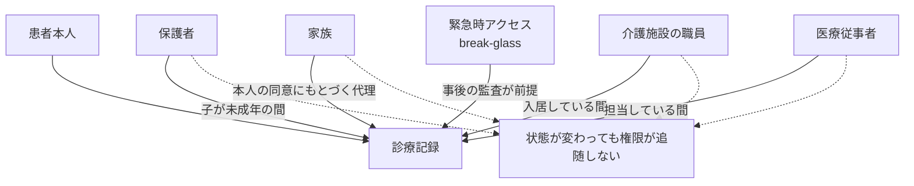

# 患者用ポータルで狙われやすい脆弱性

患者用ポータル、オンライン診療、Web 予約システムを対象に、実際に発見されやすい脆弱性と、その確認観点をまとめる。

> [!NOTE]
> **表記ルール**：本ページでは、**事実**（一次情報で確認できる内容。出典を併記する）、**報道ベース**（報道のみで確認でき、当事者の公表資料では裏付けが取れていない内容）、**分析**（筆者の解釈）を書き分ける。
> 出典は、当事者の公表資料、行政文書、CVE、ベンダアドバイザリなどの一次情報を優先して示す。

> [!WARNING]
> 本ページは、自組織のシステムの点検、およびバグバウンティプログラムや脆弱性診断など、許可された範囲での検証を想定している。
> 許可のないシステムへの検証行為は、多くの国で法令違反にあたる。
> 医療システムでは、検証行為そのものが実在する患者の診療を妨げる可能性がある点にも注意がいる。

---

## 1. IDOR と認可制御の不備

医療系 Web アプリで最も影響が大きく、かつ最も頻繁に見つかる脆弱性である。

### なぜ医療で多発するのか

医療システムは、患者を識別するための番号を業務上あちこちで使う。
診察券番号、カルテ番号、受診 ID、検査 ID、予約番号といった識別子が、そのまま URL やリクエストパラメータに現れやすい。
しかも、これらの番号は連番であることが多い。

### 確認すべき箇所

| 機能 | 典型的なパラメータ | 確認内容 |
|---|---|---|
| 診療記録の参照 | `patient_id`, `karte_no`, `encounter_id` | 他人の ID に変更して参照できないか |
| 検査結果の閲覧 | `result_id`, `order_id` | 結果の PDF や画像に直接アクセスできないか |
| 予約の確認, 変更 | `reservation_id`, `booking_ref` | 他人の予約を閲覧, 変更, 取消できないか |
| 明細, 請求 | `invoice_id`, `receipt_id` | 領収書, 診療明細を横断的に取得できないか |
| 添付文書 | `document_id`, `file_id` | 紹介状, 診断書, 画像を直接取得できないか |
| 家族アカウント連携 | `dependent_id`, `family_id` | 連携解除後も参照が続かないか。他人を勝手に連携できないか |
| API | REST, GraphQL の各エンドポイント | 画面側の権限チェックが API 側で欠落していないか |

### 見落とされやすい観点

- 画面には権限チェックがあるが、印刷用画面や PDF 生成エンドポイントには適用されていない。
- 参照は制限されているが、更新系（キャンセル、再送信、通知先変更）には適用されていない。
- ID を UUID に変えたことで対策済みとされているが、検索機能やオートコンプリートから ID を列挙できる。
- 医療従事者ロールが、担当外の患者まで参照できる。医療では「緊急時に全患者へアクセスできる」設計（break-glass）が正当な要件として存在するため、記録と事後監査で担保されているかが論点になる。

### 対策

- 認可判定を、データ取得層で一元的に行う。画面ごとの実装に任せない。
- 「この利用者が、この患者の情報を見てよいか」を、リクエストごとに評価する。
- 参照ログを患者単位で記録し、通常と異なる参照パターンを検知する。

---

## 2. 認証設計の弱さ

### 医療特有の弱い認証要素

医療システムでは、患者が覚えやすい値を認証に使う圧力が強い。
その結果、次のような設計が採用されることがある。

| 設計 | 問題 |
|---|---|
| 診察券番号 + 生年月日でログイン | どちらも第三者が知りうる。総当たりも容易である |
| 初期パスワードが生年月日 | 変更を強制しなければ、そのまま使われ続ける |
| 電話番号の下 4 桁で本人確認 | 家族や同僚が知っている値である |
| メールアドレスなしでの登録 | パスワード再発行の手段が窓口対応に限られ、なりすましの余地が生まれる |

### 確認観点

- 登録, ログイン, パスワード再設定の各フローで、アカウントの存在有無が応答から判別できないか。
- レート制限が、IP 単位だけでなくアカウント単位でも適用されているか。
- 多要素認証を利用できるか。利用者がオプトインできる形でも用意されているか。
- セッションの有効期限と、ログアウト時の破棄が適切か。共有端末での利用を想定した設計になっているか。

---

## 3. アカウント連携と代理アクセス

医療系ポータルには、一般的な Web サービスにない「代理」の概念がある。

- 保護者が子どもの記録を見る
- 家族が高齢の親の予約を管理する
- 介護施設の職員が入居者の情報を扱う

この代理関係は、時間とともに変化する。
子どもが成人する、離婚により親権が変わる、施設を退去する、といった状態変化に権限が追随しない実装は、そのまま脆弱性になる。

**分析**：図の破線が指す箇所が、この機能の弱点になる。
成人、離婚、退去、担当交代のいずれも、システム側で権限を見直す契機として実装されていないことが多い。

### 確認観点

- 連携の申請と承認の流れで、相手方の同意が必要になっているか。
- 連携解除後に、過去のデータへの参照が残らないか。
- 代理人がアクセスできる範囲が、必要な情報に限定されているか。
- 未成年から成人への移行時に、保護者の権限が自動的に見直されるか。

---

## 4. ファイルの取り扱い

医療系ポータルは、紹介状、診断書、検査画像、同意書といった多様な文書を扱う。

| 観点 | 内容 |
|---|---|
| アップロード | 拡張子と MIME だけの検証で済ませていないか。保存先が公開ディレクトリになっていないか |
| ダウンロード | ファイル名やパスをパラメータで指定していないか。認可判定がファイル配信経路にも適用されているか |
| 生成 PDF | 帳票生成ライブラリを介した SSRF やテンプレートインジェクションが成立しないか |
| 医用画像 | DICOM を扱う場合、匿名化とファイル構造の検証が行われているか（[詳細](../medical-devices/pacs-dicom.md)） |

---

## 5. 情報の露出

| 種別 | 医療での現れ方 |
|---|---|
| エラーメッセージ | 患者の存在有無、氏名の一部、システム構成が応答に含まれる |
| 検索の応答 | 部分一致検索が、意図せず患者名の列挙を許す |
| 通知メール, SMS | 診療内容や検査結果が本文に含まれ、第三者に見られる |
| キャッシュ | 共有端末でブラウザバックにより前の患者の情報が表示される |
| ログ | 患者 ID や病名がアクセスログに記録され、運用者の目に触れる |

医療機関の共有端末では、ブラウザのキャッシュ制御が実際の情報漏えい経路になる。
`Cache-Control: no-store` の適用範囲を、画面だけでなく API 応答と生成ファイルにも広げる必要がある。

---

## 6. オンライン診療に固有の論点

| 論点 | 内容 |
|---|---|
| 待機室（Waiting Room） | 他の患者の名前や予約情報が見えないか。URL を知る第三者が入室できないか |
| 映像, 音声 | 通信が暗号化されているか。録画の保存先と保存期間が定義されているか |
| 画面共有 | 医療従事者側の画面共有により、他の患者の情報が映り込まないか |
| 処方 | 電子処方箋の引換番号が推測可能でないか |

---

## バグバウンティで医療系を扱うときの注意

医療系のプログラムを対象とする場合、通常のスコープ確認に加えて、次の点を確認しておく。

- 本番環境での検証が許可されているか。ステージング環境が提供されているか。
- 実在する患者データに触れた場合の報告手順が定められているか。
- 自動スキャンが禁止されていないか。医療システムでは、スキャンによる負荷が診療に影響しうる。
- 発見した情報を保持してよい範囲が定められているか。要配慮個人情報は、証跡としてもスクリーンショットを残しにくい。

> [!IMPORTANT]
> 医療システムで実在の患者データに到達した場合、その時点で検証を止め、データを保存せず、直ちにプログラム運営者へ報告する。
> 「影響を実証するために」データを追加取得する行為は、正当化できない。

---

## 関連ページ

- [OSS 電子カルテ, HIS の脆弱性](../oss-vulnerabilities/ehr-systems.md)
- [ガイドラインと法規制](../guidelines/)
- [ツール](../resources/tools.md)

---

[← 医療系 Web アプリのセキュリティ](README.md) | [トップへ](../../README.md)
