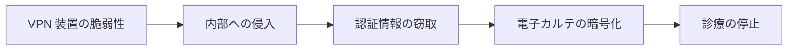

# awesome-healthcare-security レビュースキル

本リポジトリの文書をレビューするための手順である。
文書を追加または編集したら、コミットの前にこのレビューを実行する。

## 前提

本リポジトリは**公開リポジトリ**であり、医療とセキュリティという、誤りが実害につながる領域を扱う。
レビューは、次の六つのレンズで行う。

| レンズ | 問い |
|---|---|
| A. 一次情報 | その記述は、誰が公表した何にもとづくのか |
| B. 事実と推測 | 事実、報道ベース、分析が書き分けられているか |
| C. 文章規範 | 日本語技術文書の規範に適合しているか |
| D. 公開適格性 | 公開リポジトリに載せてよい内容か |
| E. 構成の整合 | リンクと索引が壊れていないか |
| F. 図解 | 構造と因果が、文章だけで説明されていないか |

---

## 手順 1：校正規範を読み込む

日本語の文章規範は、リポジトリ内の [`skills/japanese-tech-writing/SKILL.md`](../japanese-tech-writing/SKILL.md) に従う。

レビューを始める前に、この文書を読む。

```bash
cat skills/japanese-tech-writing/SKILL.md
```

読み込めない場合は、下記「レンズ C」の要点に従ってレビューする。

---

## 手順 2：機械的に検出できる違反を洗う

同梱のスクリプトが、六つの検査をまとめて実行する。

```bash
bash skills/repo-review/scripts/check.sh              # リポジトリ全体
bash skills/repo-review/scripts/check.sh docs/threats/incidents  # 対象を絞る
```

スクリプトが実行できない場合は、個別に実行する。

```bash
# 日本語の地の文、見出しのダッシュ（英語表記と CONTRIBUTING の説明箇所を除く）
grep -rn "—\|――" --include="*.md" . | grep -v README-en.md | grep -v CLAUDE.md | grep -v CONTRIBUTING.md | grep -v skills/

# 並列の中黒（固有名詞の内部は許容。個別に判断する）
grep -rn "・" --include="*.md" . | grep -v README-en.md | grep -v CLAUDE.md | grep -v CONTRIBUTING.md | grep -v skills/

# LLM 的な空虚表現
grep -rnE "重要なのは|不可欠|極めて|非常に|大いに|掘り下げ|多角的|包括的|正面から|に他ならない|と言えるだろう" --include="*.md" .

# 文体の不統一（本文は「である」調に統一する。手順の指示文は除く）
grep -rn "です。\|ます。\|ません。\|でしょう。" --include="*.md" docs/ monthly-reports/ README.md | grep -v "ください。"

# 出典のない「事実」ブロック（目視で確認する）
grep -rn -A6 "^\*\*事実\*\*" --include="*.md" docs/ monthly-reports/ | grep -c "http"

# 図のないページ（構造や流れを扱うページには図を検討する）
for f in $(find docs monthly-reports -name "*.md"); do
  grep -q '```mermaid\| $target"
done
```

外部リンクの確認は、`scripts/link-check.sh` を手元で実行する（CI では行わない。[CONTRIBUTING.md](../../CONTRIBUTING.md) の「リンク切れをローカルで確認する」を参照）。

> [!IMPORTANT]
> `scripts/link-check.sh` は引数を省略すると `git ls-files` の結果を対象にする。
> 新規ページは `git add` を済ませてから実行しないと、確認の対象から漏れる。

---

## レンズ F：図解

構造と因果は、文章で説明するより図で示すほうが速く伝わる。
本リポジトリでは、図解を積極的に用いる。

**図にすべきもの**

| 対象 | 図の種類 |
|---|---|
| 攻撃の流れ（初期侵入から影響まで） | フローチャート |
| システム間の関係（誰がどこに接続しているか） | 構成図 |
| 因果の連鎖（一つの欠陥が何を引き起こすか） | フローチャート |
| 責任分界（どの規制が誰に適用されるか） | 階層図 |
| 通信の手順（プロトコルのやり取り） | シーケンス図 |
| 時系列（インシデントの経過） | フローチャートまたは表 |
| データ構造（ファイル形式など） | コードブロック内の図 |

**確認事項**

- [ ] 三つ以上の要素の関係を文章だけで説明している箇所がないか
- [ ] 攻撃の流れ、防御の階層、規制の適用関係を扱うページに図があるか
- [ ] 図と本文が矛盾していないか
- [ ] 図がなくても本文だけで理解できるか（図は理解を速めるものであり、本文の代替ではない）
- [ ] 装飾のためだけの図を置いていないか

**記法の使い分け**

図の種類は、示したい内容によって選ぶ。

| 手段 | 適する対象 | 理由 |
|---|---|---|
| **Mermaid** | 関係、流れ、階層、時系列、シーケンス | テキストで書けるため差分が読める。GitHub がそのまま描画する。編集の敷居が低い |
| **SVG（`assets/` に置く）** | バイト構造、層の重なり、対応表としての図、位置関係が意味を持つ図 | Mermaid ではレイアウトを制御できない。注釈や寸法を正確に置ける |
| **コードブロック** | ディレクトリ構成、ファイル形式のバイト列、コマンドの出力例 | 等幅で示すことに意味があり、図にするまでもない |

**Mermaid を選ぶ場合**

````markdown

````

注意する点を挙げる。

- 日本語ラベルは `["..."]` で囲む。括弧や読点を含む場合は必ず引用符を使う
- ラベル内の改行は `<br>` で入れる
- 色の指定は控える。閲覧者のテーマ（明色、暗色）によって見え方が変わる

**SVG を選ぶ場合**

SVG は `assets/` に置き、`` で参照する。
GitHub は Markdown 中のインライン `<svg>` 要素を除去するため、ファイルとして置く必要がある。

```markdown
<p align="center">
  
</p>
```

作成時に守る点を挙げる。

- `viewBox` を指定し、幅は `width="100%"` で可変にする。固定ピクセル幅にしない
- 明色テーマと暗色テーマの両方で読めるようにする。SVG 内の `<style>` に `@media (prefers-color-scheme: dark)` を書き、塗りと文字色を切り替える
- `role="img"` と `aria-label`、または `<title>` を入れる。`alt` 属性も併せて書く
- 図中の文字は本文と同じ表記規範に従う（並列の中黒を使わない、ダッシュを使わない）
- 元データを持たない画像（PNG のスクリーンショットなど）を図として使わない。修正できなくなる

**どちらでもよい場合**

Mermaid を選ぶ。
テキストで残るほうが、後から修正しやすい。

---

## 手順 3：報告する

指摘は、次の形式で列挙する。

```
[レンズ] ファイル:行
記述：（該当箇所の引用）
問題：（何が規範に反するか）
対応：（具体的な修正案）
```

指摘がない場合も、確認したレンズを明示して報告する。

## 手順 4：修正する

修正後、手順 2 の機械的検出を再実行し、新たな違反が生じていないことを確認する。

---

## 参照

- [`scripts/check.sh`](scripts/check.sh)：機械的な検出をまとめて実行する
- [CONTRIBUTING.md](../../CONTRIBUTING.md)：貢献者向けの規範
- [CLAUDE.md](../../CLAUDE.md)：執筆方針
- [docs/reference/_templates/](../../docs/reference/_templates/)：事例追加のテンプレート

## このスキルを使う理由

医療とセキュリティの情報は、誤りがそのまま実害につながる。
出所の曖昧な数値が引用され、未確定の帰属が事実として広まり、対策の判断を誤らせる。
本リポジトリが第一人者の仕事として読まれるためには、書いた内容の一つひとつについて「これは誰が公表した何にもとづくのか」に答えられる状態を保つ必要がある。
このレビューは、その状態を維持するための手順である。
